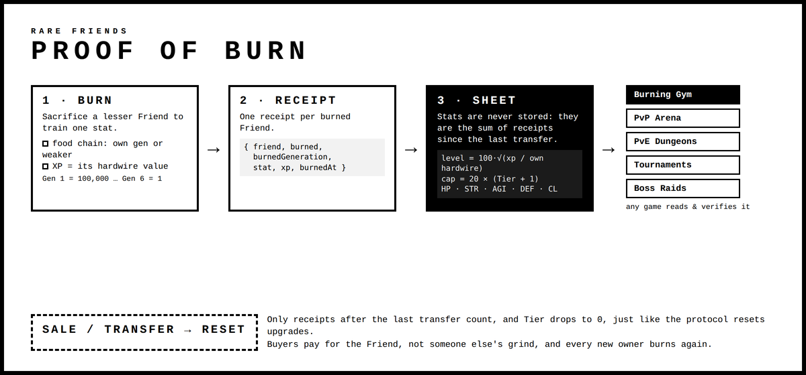

# Proof of Burn — a shared character sheet for Rare Friends

**Status:** v1, draft. Used by Burning Gym, where every burn is simulated. The on-chain part below is a proposal.

## The idea

A Friend's stats are **not stored**. They are **derived from burn receipts**: one receipt for every Friend that was sacrificed to train it since its last transfer. Any game that reads the same receipts and applies the same rules gets the same character sheet:

- HP, Strength, Agility, Defence (XP and level);
- Tier cap;
- combat numbers.

That makes the sheet **verifiable** (every point of every stat traces back to a burned NFT) and **portable** (PvP, PvE, tournaments or raids can all read it). It also makes the sheet **fair on sale**: like Tier in the Rare Friends protocol, the sheet resets when the Friend is transferred.



Reference implementation: [`proof-of-burn.ts`](proof-of-burn.ts). It is pure TypeScript with no React, DOM or SDK runtime dependency, so you can copy it into any game.

## Burn receipt (v1)

```json
{
  "v": 1,
  "friend": "12813",
  "burned": "49413",
  "burnedGeneration": 6,
  "stat": "str",
  "xp": 1,
  "trainingSeconds": 5,
  "burnedAt": 1790270461000,
  "trainedAt": 1790270466000
}
```

| Field | Meaning |
|---|---|
| `friend` | Token id of the Friend being trained (decimal string). |
| `burned` | Token id of the Friend that was burned. |
| `burnedGeneration` | 1–6. Must be ≥ the trained Friend's generation (food chain). |
| `stat` | `hp`, `str`, `agi` or `def`. |
| `xp` | The burned generation's hardwire value: Gen 1 = 100,000, Gen 2 = 10,000, Gen 3 = 1,000, Gen 4 = 100, Gen 5 = 10, Gen 6 = 1. |
| `trainingSeconds` | `5 × 6^(6 − gen)`: 5 s (Gen 6), 30 s, 3 m, 18 m, 1 h 48 m, 10 h 48 m (Gen 1). |
| `burnedAt` / `trainedAt` | Unix ms. XP only counts once `trainedAt` is set. |

## Rules

1. **Food chain.** A Friend may burn only its own generation or weaker: `burnedGeneration >= ownGeneration`.
2. **Stat XP** = the sum of `xp` over finished receipts for that stat, counting only receipts after the Friend's last transfer.
3. **Level** from XP, with `scale` = the Friend's own hardwire value: `level = floor(100 × sqrt(min(1, xp / scale)))`, then clamp to `[1, cap]`. One Friend of your own generation (`xp = scale`) takes a stat to 100. XP needed for a level is `scale × (level / 100)²`.
4. **Tier caps.** Tier 0–4 caps every stat at 20 / 40 / 60 / 80 / 100. XP above the cap is kept and counts after the next Tier upgrade. Tier upgrades are paid in RF at the official prices; by protocol, 50% of each payment is burned.
5. **Reset on transfer.** A sale or transfer resets the sheet (only newer receipts count) and Tier, matching the protocol ("a direct transfer clears activation and upgrades").

## Combat numbers

| Number | Formula |
|---|---|
| Max HP | `9 + HP level` |
| Max hit | `floor(1 + Strength level × 0.5)` |
| Seconds per attack | `1.5 / (1 + Agility level × 0.01)` |
| Damage blocked per hit | `Defence level − 1` (a landed hit always deals ≥ 1) |
| Hit chance | `50% + 0.5% × (your Agility − opponent Agility)`, clamped to 20–90% |
| Combat Level | the average of the four levels |

## Reading a sheet in your game

```ts
import { buildCharacterSheet, type BurnReceipt } from "./proof-of-burn";

const sheet = buildCharacterSheet({
  friendId: "12813",
  generation: 3,
  tier: 1,
  receipts,            // BurnReceipt[] from your source (events, API, JSON)
  lastTransferAt,      // Unix ms of the Friend's last transfer, 0 if none
});

sheet.stats.str.level;     // e.g. 31
sheet.combat.maxHit;       // e.g. 16
sheet.combat.combatLevel;  // e.g. 12
```

In Burning Gym, open your portrait → **Character** → **Proof of burn**. The Proof of Burn card shows the totals (Friends burned, XP gained, hardwire burned, Combat Level and Tier cap) and the burned Friends themselves. Below it are the receipt log and the full sheet as JSON.

## Proposal: on-chain events

For the live version, the burn contract would only need to emit one event per burn:

```solidity
event FriendBurned(uint256 indexed friend, uint256 indexed burned, uint8 burnedGeneration, uint8 stat, uint256 xp, uint64 trainedAt);
```

Games rebuild the sheet from `FriendBurned` logs where `friend` matches and the block comes after that Friend's last `Transfer`. No stat storage and no per-game database are needed, and anyone can verify the result. Feedback from the Rare Friends team on this format is very welcome.
