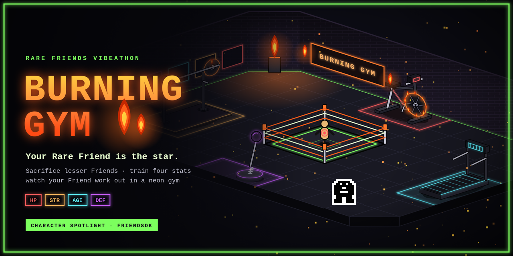
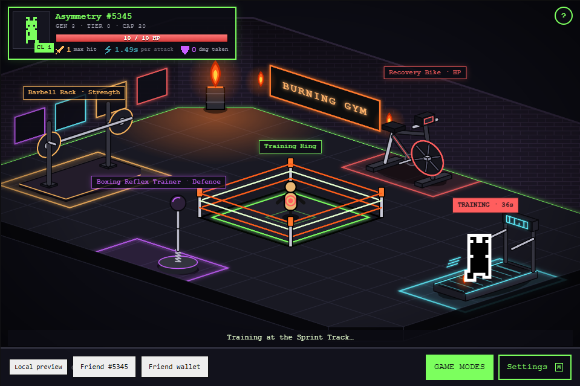
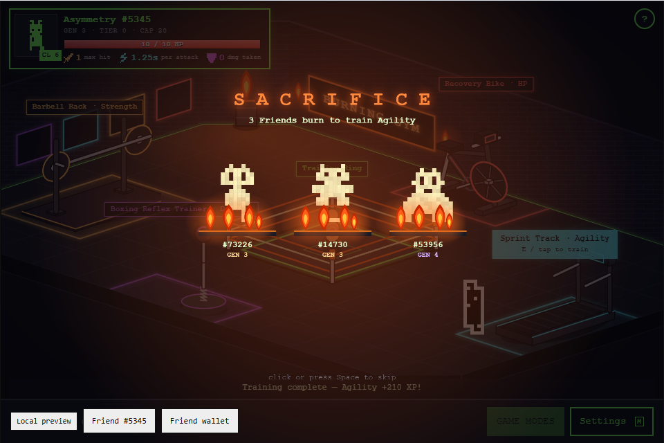
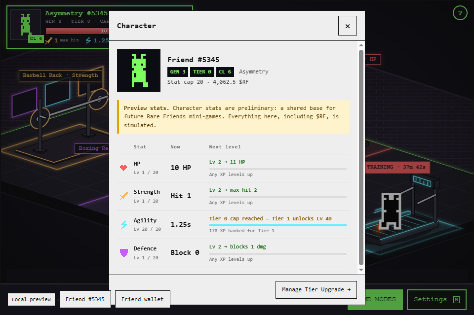

# Burning Gym



Your Rare Friend trains in a neon-lit underground gym. Burn lesser Friends to feed its training, raise its four stats and test your build in the sparring ring.

> **Preview stats.** The character stats (HP, Strength, Agility, Defence) are preliminary. They are a shared base for future Rare Friends mini-games — PvP, PvE, tournaments, raids — not a finished economy. Everything in this build, including $RF, is simulated.

The gym is meant as that base: the stats, the burn-to-train loop and the Tier caps belong to the Friend, not to this room, so other games can read and reuse them.

Built with FriendSDK v0.1.2.

## Why burning: a progression base for Rare Friends NFTs

Burning Gym is built around one idea: **burning NFTs should make your Friend stronger**. Instead of sitting unused in wallets, lesser Friends become fuel. Your main Friend turns them into permanent, readable stats that future Rare Friends games can build on.

### What it solves

- **Spare Friends get a use.** Common and duplicate Friends (Gen 5–6 especially) have no role today. Here they are training fuel, which creates demand for exactly the Friends people hold most of.
- **Supply goes down, permanently.** A burned Friend leaves circulation. Every Generations NFT was originally hardwired with $RAREFRIENDS, so each burn removes that RF value from the market.
- **A recurring RF sink.** Tier upgrades are paid in RF at the official prices. By the Rare Friends protocol, every upgrade payment is split **50% burned / 50% RF rewards**.
- **Progression that belongs to the Friend.** HP, Strength, Agility and Defence (plus Tier and Combat Level) form one shared character sheet. PvP, PvE, tournaments and raids can all read it, so a Friend trained here matters everywhere.
- **Rarity is respected.** The food chain lets a Friend burn only its own generation or weaker ones, and XP scales 10× per generation. Rare Friends need rare fuel, which keeps the value hierarchy intact.

### Stats reset on sale, just like Tier

The Rare Friends protocol already says: *"A direct transfer clears activation and upgrades; reactivation costs 10% of that generation's hardwire price and starts at tier 0."* Burning Gym follows the same rule for its stats. **When a Friend is sold or transferred, its stats and Tier reset.** This means:

- a buyer pays for the Friend itself (its generation and art), not for someone else's grind;
- the secondary market can't be used to skip training;
- every new owner burns and upgrades again, so the sink keeps working with every sale.

*(In this preview, stats live only in the current session. Reset-on-transfer is the rule for the on-chain version and matches how the protocol already treats Tier.)*

### The numbers: one fully built Friend

"Fully built" means all four stats at 100 and Tier 4. The figures below use the official Hardwire and upgrade tables; amounts are in RF.

| Generation | Hardwire | Friends burned to max 4 stats | …or in Gen 6 Friends | Tier 0→4 upgrades | of which burned (50%) | Reactivation after a sale |
|---|---|---|---|---|---|---|
| Gen 1 | 100,000 | 4 × Gen 1 (400,000 of hardwire value) | 400,000 | 406,250 | 203,125 | 10,000 |
| Gen 2 | 10,000 | 4 × Gen 2 (40,000) | 40,000 | 40,625 | 20,312.5 | 1,000 |
| Gen 3 | 1,000 | 4 × Gen 3 (4,000) | 4,000 | 4,062.5 | 2,031.25 | 100 |
| Gen 4 | 100 | 4 × Gen 4 (400) | 400 | 406.25 | 203.13 | 10 |
| Gen 5 | 10 | 4 × Gen 5 (40) | 40 | 40.63 | 20.31 | 1 |
| Gen 6 | 1 | 4 × Gen 6 (4) | 4 | 4.06 | 2.03 | 0.1 |

In short, a fully built Friend retires about **4× its own hardwire value in burned Friends** and burns another **~2× its hardwire in RF** through Tier upgrades. Because of reset-on-sale, that cost is paid again by every new owner. A single fully built Gen 3 Friend, for example, removes 4 Gen 3 Friends (or 4,000 Gen 6 Friends) from supply and burns about 2,031 RF.

## Requirements

- A browser wallet on Robinhood mainnet (chain 4663) holding a hardwired Rare Friends Generations NFT (generation 1 or higher). The SDK runtime handles wallet connection, Friend selection and the fresh ownership check. The game code does not add its own.
- Node.js 22 or newer to build and run locally.

## Run locally

From the FriendSDK root:

```
npm ci
npm run dev:game -- games/burning-gym --port 4173
```

Then open `http://localhost:4173`. To build a static preview:

```
npm run build
node scripts/dev-game.mjs build games/burning-gym
```

The output is written to `games/burning-gym/.friendsdk/`.

## Controls

- **WASD / arrow keys** walk. **Tap or click** the floor to walk there.
- Walk up to a station and press **E**, or tap its prompt. You can also click the equipment itself, and your Friend will walk over and start training.
- During the sacrifice animation, a **click, tap, Space, Enter or Esc** skips straight to training.
- **M** toggles sound. Settings also has mute and a reduce-motion option, and the game follows the system's reduced-motion preference.
- **?** opens the in-game help.

## How it plays

1. **Pick a station.** Each station trains one stat:

   | Station | Stat |
   |---|---|
   | Recovery Bike | HP |
   | Barbell Rack | Strength |
   | Sprint Track | Agility |
   | Boxing Reflex Trainer | Defence |

2. **Sacrifice (burn) lesser Friends** to that station. You can select several at once. Your Friend can only burn its own generation or weaker ones (the "food chain"). Each burned Friend gives XP and adds training time, from 5 s for a Gen 6 Friend up to about 10 h 48 m for a Gen 1.
3. **Wait out the training.** The stat grows once the timer ends. Burning one Friend of your own generation maxes a stat. Levels follow a quadratic curve, so smaller burns still help.
4. **Tier caps.** Tier 0–4 caps each stat at 20 / 40 / 60 / 80 / 100. Tier upgrades cost RF, priced from the Rare Friends upgrade table: `generationMultiplier × 0.5 × 1.5^step`.
5. **Training Ring.** Spar with a training dummy at any tier to test your build, live, with the combat engine the future game modes will use.
6. **Game Modes (coming soon).** PvP Arena, PvE Dungeons, Tier Tournaments and Boss Raids are shown as placeholder cards. None is playable yet.
7. **Character sheet and HUD.** The top-left frame shows real fighting numbers (max HP, max hit, seconds per attack, damage blocked) and a Combat Level (average of the four levels). Click it for the full sheet, which shows what the next level of each stat buys.

## Screenshots







## Costs, rewards and what is simulated

Everything in this MVP is simulated and labelled as such. No transactions are sent.

- **Burnable Friends.** The pool of lesser Friends is a local mock. The SDK has no burn or transfer action. In a live version, burning would destroy real Generations NFTs. Every Generations NFT is originally obtained with $RAREFRIENDS, so burning Friends indirectly removes RF value from circulation.
- **$RF balance.** Each session starts with a simulated demo balance that exactly covers every Tier upgrade for your Friend's generation, so the whole progression can be tried. There is no way to earn $RF in this build; the planned game modes would provide it.
- **Tier upgrade costs** follow the official price table but are only deducted from the local demo balance.
- **`game.json`** holds the SDK's chance-game definition, which the runtime requires. The gym's own economy runs locally and is not driven by that file.

## Art and rendering

- The world is drawn by the game's own renderer (`gym-world.tsx` + `gym-scene.ts`), a "neon basement" gym. It keeps the SDK's world geometry, collision, pathfinding, projection and input. Only the visuals are replaced, as `WORLD_RULES.md` allows.
- The selected Friend is always the canonical on-chain sprite from the SDK sprite reader. It is drawn exactly like the SDK's `GameWorld` draws it and is never recoloured.
- The gym equipment (bike, barbell rack, treadmill, reflex trainer) is drawn in code in the same isometric neon style (`gym-equipment.ts`). While a stat trains, your Friend uses that machine: it pedals the bike as the flywheel spins in a ring of fire, presses the barbell, runs on the moving treadmill belt, or punches the reflex ball. Walls, floor, sign, ring, flames and UI are also vector or canvas art written in code. No third-party or AI-generated images are used.

## Checks and known issues

- Typecheck of the game files passes. Rendering and the station → burn → training flow were checked in headless Chromium against mocked chain reads.
- Progress is not saved between sessions.
- Station equipment has no collision, so your Friend can walk through machines. This is intentional, so clicking a station always finds a path to it.
